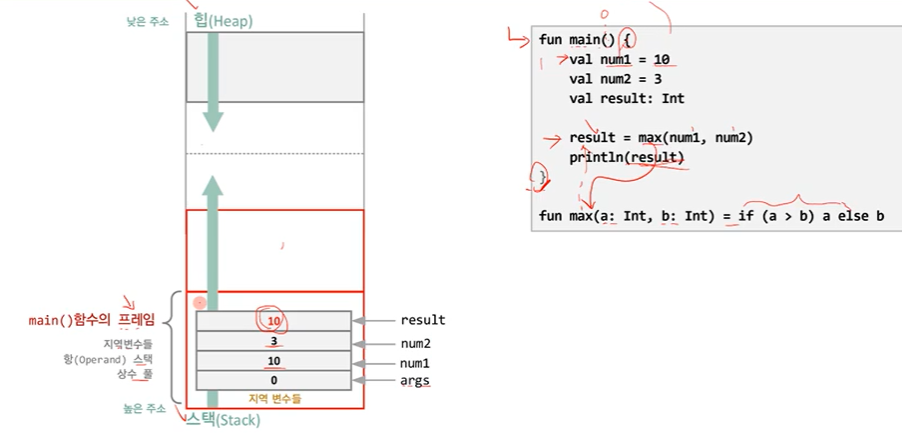

# Kotlin 함수와 스택 프레임

Heap :동적 객체를 저장

Stack : 함수 프레임 저장

위 예시 코드에 따른 스택 변화 과정

1. main() 호출에 따른 프레임 생성 후 push
2. main의 인자인 args와 main 내의 지역 변수 (num1, num2, result) 가 프레임 내에 push
3. result() 호출에 따른 프레임 생성 후 push
4. result의 인자인 num1, num2 연산 이후 return, result frame 삭제
5. main의 모든 기능을 수행한 후 main frame 삭제