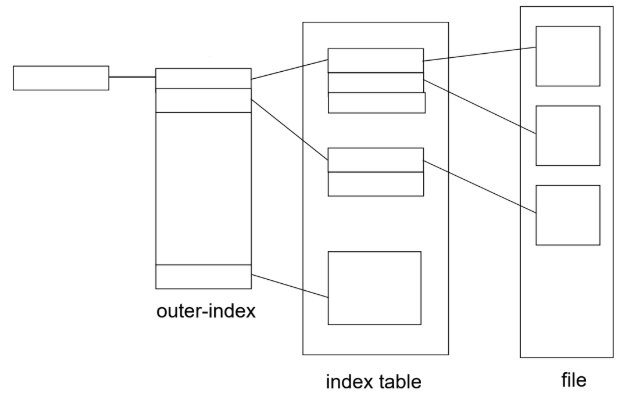
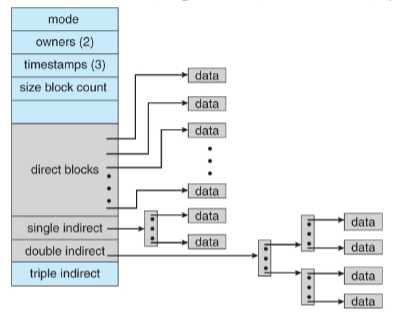

# Allocation Methods

### Contiguous allocation

각 file들을 연속적인 block의 형태로 disk에 저장

**장점**

- Starting block #, length만 알면 되기 때문에 간단하고 표현이 쉽다
- 연속적이므로 File을 읽는데 있어서 head의 움직임이 필요하지 않다.

**단점**

- 공간의 낭비 발생(external fragmentation)
- File의 크기를 할당 후에 키울 수 없다

**Extent-based allocation**

- File의 크기를 키울 수 없는 단점을 보완하기 위해 사용
- Extent : 하나의 연속적인 disk block
- 연속적인 file에 extent의 시작 주소를 저장
- File은 하나 이상의 extent로 구성

### Linked allocation

현재 disk block에 다음 disk block의 위치를 기록

**장점**

- External fragmentation 해결

**단점**

- 이전의 block들을 모두 확인해야 하기 대문에 direct access가 어려움
- 다음 block에 대한 위치를 저장하는 공간에 대해 overhead 발생(pointer를 담는 공간이 낭비)
- 특정 block이 망가지면 그 다음 block을 찾을 수 없어서 신뢰도의 문제가 발생

**FAT(File Allocation Table)**

- FAT에서 file 이름과 해당 file의 start block #를 저장
- Disk block의 수 만큼 entry 할당

### Indexed allocation

file마다 index block을 둬 그 안에 disk block #들을 저장

File이 생성되면 index block을 초기화한다 그 후 file이 write되면 index block의 entry가 할당된다.

Index block의 size에 대한 문제가 발생 가능하다

- Index block이 4KB라면, 1024개의 index만 할당 가능하다 ( 파일 크기 최대 4MB )

**Linked scheme**

- 하나의 index block을 사용
- 1024개의 index entry 존재
- 파일 최대 크기 4MB

**Multilevel index**

- Index block을 여러 개의 level로 두어 file의 크기를 늘림
- 2-level 이라면 1024 * 1024개의 entry로 4GB크기의 파일 허용 가능
- 문제점 : index block을 여러 번 읽어야 하는 문제가 발생
  - Index block을 메모리에 caching함으로써 해결 가능

**Combined scheme** (LINUX, UNIX에서 사용)

- FCB를 통한 direct block, single indirect, double indirect, triple indirect를 함께 사용
- 파일 최대 크기 : 48KB+4MB+4GB+4TB

### Efficiency and performance

성능 향상을 위해 가능한 disk에 접근하지 않도록 하는 것이 목표

Disk cache : main memory의 일부(자주 접근하는 disk block)을 buffer cache로 할당

Page cache : 자주 접근하는 page를 cache로 할당

#### Memory-mapped I/O

read/write 호출 없이 I/O 하기 위해 사용한다.

1. File의 일부를 process 주소 공간에 mapping
2. Process 주소 공간의 값을 수정하면 mapping된 file도 수정됨 ( read/write 없이 )

화면 출력 등에 자주 사용된다.

Memory-mapped I/O를 사용하지 않고 read/write를 사용하면 buffer cache만 사용하지만, memory-mapped I/O를 사용하면 page cache, buffer cache를 모두 사용해 double caching하게 된다. 이는 cache를 두개 사용하므로 공간 낭비가 될 수 있지만, system call overhead는 아예
없다.

#### Unified cache

buffer cache + page cache

**Asynchronous write**

- Buffer에 쓴 data가 바로 disk에 저장되는 게 아니라 모아서 한 번에 저장한다
- 데이터 전송을 마치기 전에 기타 process가 계속하도록 허가하는 입출력 형태 대부분의 write는 asynchronous하다.

**Synchronous write**

- Write한 data를 즉시 disk에 저장한다
- 중요한 data는 synchronous하게 disk에 바로 저장해야 한다(metadata 등)

**Free-behind** : sequential access에서 미래에 읽을 block을 미리 올리는 것

**Read-ahead** : sequential access에서 이미 읽은 block을 바로 release

### Recovery

File의 일관성(consistency)가 사라진다면, recovery 필요

Consistency checking : metadata와 data의 일관성을 체크(directory structure와 disk block의 일관성)

Disk로부터 data를 floppy disk, magnetic tape 등에 backup하고 문제가 생긴 file이나 disk를 backup으로부터 복구