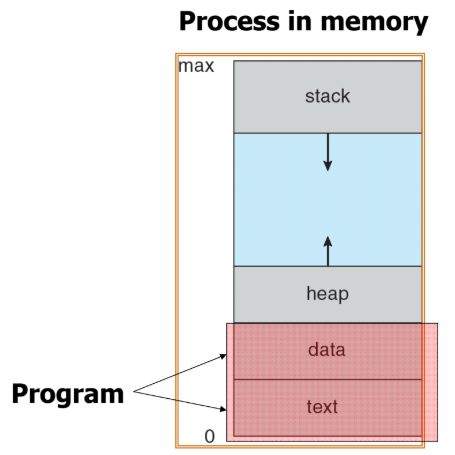
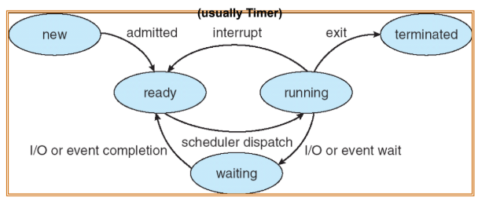
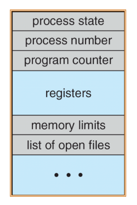

# Process Concept

### Process

실행 중인 프로그램 이라는 의미, 항상 line-by-line으로 수행 ( = job, task )

Process에는 Program이 차지하는 data, text 이외에도 stack과 heap 영역이 존재한다

- Stack : 로컬 변수, 함수 인자가 저장되는 곳 (재귀함수 등)
- Heap : 동적 할당된 메모리 공간이 쌓이는 곳

Program이 passive한 반면 process는 active하다. ( register 위치, 상태가 바뀌어가면서 실행 )

##### Process State

프로세스의 상태를 나타내고, OS마다 쓰이는 용어가 다르다.

1. New : 생성
2. Running : 수행 중 ( running state인 process는 단 하나 뿐이다 )
3. Waiting : 대기 ( 수행 불가능 ) ( 입출력 등의 특정 이벤트 후 ready -&gt; scheduling x )
4. Ready : 대기 ( 수행 가능 ) ( scheduling )
5. Terminated : 수행 완료

##### PCB ( Process Control Block )

구조체 형 변수로 process에 대한 정보를 담고있다.

1. process state
2. program counter – 다음에 수행될 instruction의 위치
3. CPU registers ( context ) – stack pointer
4. CPU scheduling information ( context ) – process priority information 등
5. Memory-management information
6. Accounting information
7. I/O status information ( Opened files )

**Context** : CPU에 할당되는 process 변경 시 수행 중이던 명령어의 주소 및 메모리 저장을 위해 필요

**Context switch** : task 간의 전환 ( program counter의 위치 저장 필요 -&gt; PCB에 저장 )