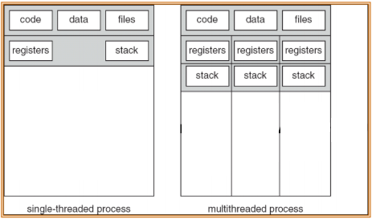

# Multithreaded Programming

### Motivation

동일한 코드를 병렬적으로 처리하기 위해 생겼다

Fork를 계속 호출하게 되면, overhead가 커지고, 결국 Process 간 IPC를 이용해야 하기 때문에 threading 이용해 이 점을 개선

### Overview

Thread : process 내에서 별도로 실행될 수 있는 하나의 개체

Multi-threaded process : 하나의 process 내에서 여러 개의 thread를 생성할 수 있고, 각각의 thread들은 별도의 stack, register를 갖지만 code, text, file, heap 영역 등을 공유한다

Multi-threaded process의 장점

1. 빠른 응답성 – 한 thread를 block해도 나머지 thread들은 작동한다.
2. 리소스 공유 – process의 code, data, resource를 공유한다.
3. 경제성 - process보다 thread를 생성하거나 context switch하는 것이 메모리, 리소스 할당 측에서 경제적이다. ( 빠르다 )
4. Multi-processor 구조에서 각각의 thread를 별도의 CPU에 할당할 수 있다.