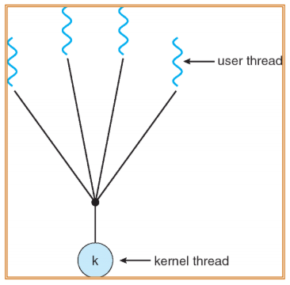
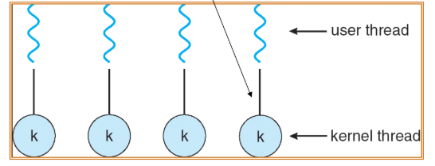
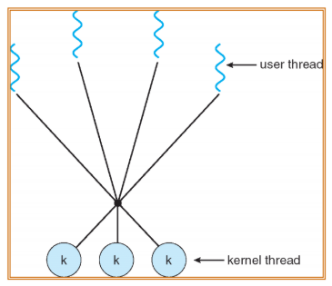
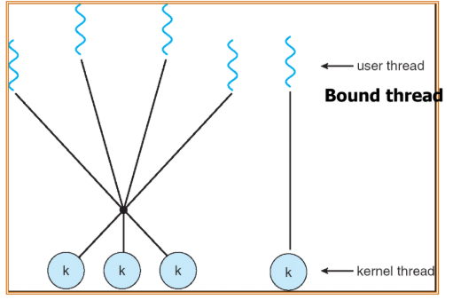

# Multithreading Models

### Thread Type

**Kernel thread**

- kernel에서 생성하는 thread
- kernel 내에서 만들어지고 삭제된다.
- 다른 process와 연동될 필요는 없다.
- Scheduling 되는 개체이다.

**User thread**

- Thread library에서 생성하는 thread
- Kernel은 user thread의 정보를 알 수 없다. -&gt; mapping 필요
- Scheduling 되지 않는 개체이다.

**Mapping**

- thread의 병렬적 수행을 위해, scheduler가 user thread를 인식하지 않기 때문에, kernel thread와 user thread를 연결하는 것
- Kernel thread가 block되면, mapping 되어 있는 user thread도 모두 block된다

### Multithreading Models

1. **Many-to-one**

   

   - 단 1개의 kernel thread에 여러 user thread를 mapping
   - 빠르고, overhead가 작다.
   - 1개 thread가 block system call 호출 시(Disk I/O 요청 시), 전체가 block된다.

2. **One-to-one**

  

  - 1개의 kernel thread에 1개의 user thread만을 mapping
  - 하나의 thread가 block되더라도 나머지는 제대로 동작한다.
  - Multiprocessor에서 다수의 thread가 병렬적으로 수행되도록 한다.
  - Kernel thread를 계속 생성하는 것에 resource가 많이 든다는 단점이 있다.
  - Linux와 windows에서 이 model을 사용한다.
  - Linux에서는 mapping되는 것이 아니라 별도 PCB에 할당되는 방식

3. **Many-to-many**

  

  - 다수의 user thread와, 그보다 적거나 같은 수의 kernel thread들이 multiplexing을 통해 mapping
  - 1개 thread가 block을 하더라도 연결된 다른 thread들은 block되지 않는다. ( multiplexing을 통해 mapping된 나머지 kernel thread가 있기 때문 )
  - One-to-one과 many-to-one의 장점을 서로 합쳤다.
  - 장점
    1. User thread를 필요한 만큼 생성 가능
    2. Kernel thread는 병렬적으로 multiprocessor에서 사용 가능
    3. Kernel thread 하나가 block되도 나머지 thread를 scheduling해준다.
  - LWP(lightweight process)
    - multiplexing을 도와주는 역할로, many-to-many, two-level만 의미를 가짐
    - User level에 존재
    - Kernel thread 하나 당 LWP 하나가 mapping
    - 목적 : kernel thread의 개수와 multiplexing 방법을 최적화 하는 것
    - 방법 : upcall - kernel 정보를 user-level(thread library)로 넘겨 주는 것
    - Kernel과 thread library 간의 communication이 요구된다.
      - CPU-bound에서는 하나의 LWP가 효율적 ( 하나의 연산만 수행해서 )
      - I/O intensive application에서는 많은 LWP 요구 ( 지속적인 I/O 연산으로
        인해 block이 발생해서 )

4. **Two-level model** 

  

  - many-to-many + one-to-one 둘을 합쳐 같이 사용
  - One-to-one 부분을 bounded thread라고 한다