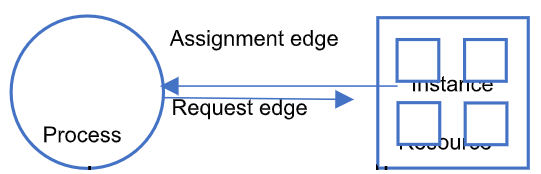

# System Model & Resource Allocation Graph

### System Model

**Resource type** : resource type을 R1,R2, … ,Ri 로 나타낸다.

- Physical resources(CPU, Memory, I/O device)
- Logical devices(file, semaphore)

**Instance** : 각 resource type이 갖는 instance의 수를 W1,W2, … ,Wi로 나타낸다.

- ex) R1 = CPU core일 때 core의 개수가 8개라면 W1 = 8이다

Process의 resource 사용 상태

1. Request(요청) -&gt; semaphore의 entry section
2. Use(사용 중) -&gt; semaphore의 critical section
3. Release(사용 완료 후 놓아줌) -&gt; semaphore의 exit section

### Resource Allocation Graph

Vertex와 edge의 집합으로 이루어진 graph

Vertex의 종류는 process(P)와 resource(R)로 구성

Edge의 종류는 request edge(P-&gt;R)과 assignment edge(R-&gt;P)로 구성

Graph를 그려 circular wait이 있는지 확인

1. Circular wait이 없는 경우 -&gt; Deadlock은 발생하지 않는다
2. Circular wait이 있는 경우
   1. 각 resource에 instance가 한 개씩만 존재한다면, deadlock이 반드시 발생
   2. 각 resource에 instance가 여러 개 존재한다면, deadlock이 발생할 가능성이 있을 뿐 반드시 발생하는 것은 아님 ex) 