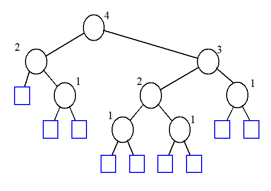
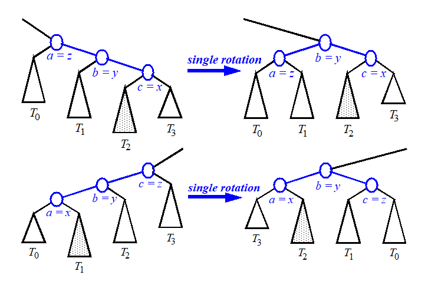
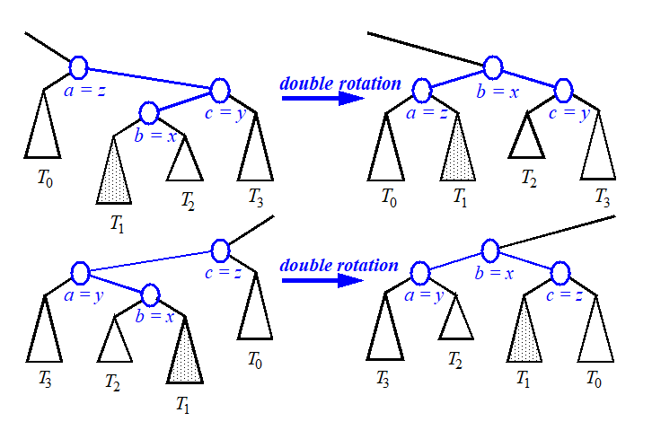
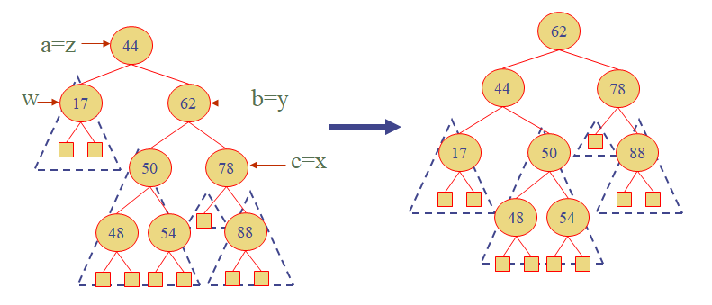

# AVL Tree

균형 잡힌 binary tree로, 모든 내부 노드의 자식 높이가 최대 1만큼만 다를 수 있다.

AVL Tree의 높이는 O(logn)이다.

##### Insert

- 노드를 삽입할 때 Binary Search Tree처럼 탐색하지만, leaf node에만 새로운 노드를 추가할 수 있다.

- 노드가 추가되었을 때 AVL Tree의 규칙 (자식 높이의 차이가 최대 1)을 어긴다면, Restructuring을 진행한다.

  1. Single Rotation

     

  2. Double Rotation

     

##### Removal

- 노드 삭제 후에도 마찬가지로 AVL Tree의 속성을 어길 수 있다.

  

##### Performance

- Restructuring Function : O(1)
- find, put, erase : O(logn) -> AVL Tree의 높이는 O(logn)이므로
