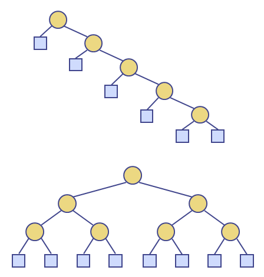

# Binary Search Tree

모든 노드가 자신의 왼쪽 자식 노드보다 크거나 같은 key값을 갖고, 오른쪽 자식 노드보다 작거나 같은 key값을 가지고 있는 이진 트리

##### Search

```pseudocode
Algorithm TreeSearch(k, v)	
	if v.isExternal ()
        return v
    if k < v.key()
        return TreeSearch(k, v.left())
    else if k = v.key()
        return v
    else { k > v.key() }
        return TreeSearch(k, v.right())
```

leaf에 도달한다면, 해당 key값을 가지는 노드가 존재하지 않는 것

노드를 삽입/삭제할 때도 Search를 사용해 삽입/삭제할 위치를 탐색한다.

##### Performance

트리의 높이 h에 따라 달라진다.

- 사용 공간 : O(n)
- 각 메서드 : O(h) => best case O(logn) / worst case O(n)

