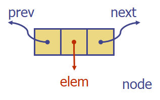
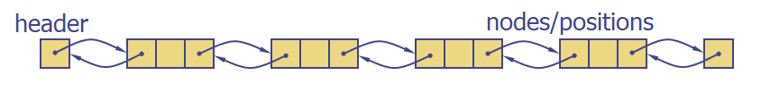

# Doubly Linked List

**node 구성**

**Doubly Linked List**

##### 주요 함수

- begin(), end() : doubly linked list의 맨 앞/뒤 원소를 반환
- insertFront(object o), insertBack(object o) : doubly linked list의 맨 앞/뒤에 원소 o를 삽입
- removeFront(), removeBack() : doubly linked list의 맨 앞/뒤 원소를 삭제
- insert(position p, object o) : doubly linked list의 p 위치에 원소 o를 삽입
- remove(position p) : doubly linked list의 p 위치의 원소를 삭제
- size()
- empty()

##### Position ADT

데이터 구조 내의 위치(주소값) 개념을 모델링

##### Performance

- 사용 공간 : O(n)
- begin(), end(), insertFront(o), insertBack(o), removeFront(), removeBack(), insert(p,o), remove(p), size(), empty() : O(1)