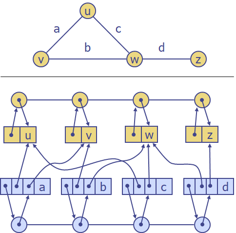
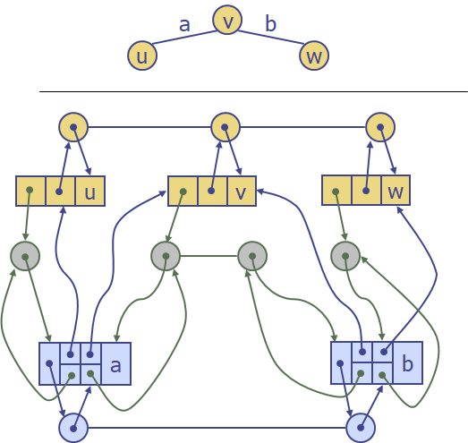
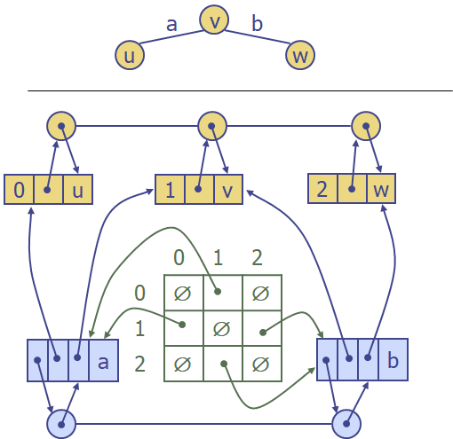

# Graph

graph는 (V, E)의 쌍이다.

- V : vertices, 노드들의 집합
- E : Edges, 노드 사이의 간선들의 집합

##### 용어

- Directed Edge (유향 간선) : 한 정점에서 다른 정점으로 향하는 간선
- Undirected Edge (무향 간선) : 두 정점 간 방향 없이 서로 연결된 간선
- Directed Graph (유향 그래프) : 유향 간선으로만 이루어진 그래프
- Undirected Graph (무향 그래프) : 무향 간선으로만 이루어진 그래프
- Incident : 특정 정점에 인접한 간선을 나타낼 때 
- Adjacent : 어떤 두 정점 사이에 간선이 존재해 정점 간 이동이 가능해 인접할 때
- Degree : 특정 정점에 연결된 간선의 개수
- Self-loop : 어떤 노드에서 자기 자신으로 향하는 간선
- Path : 어떤 정점에서 출발해 다른 정점까지 도달하는 경로
- Cycle : 어떤 정점에서 출발해 자기 자신까지 도달하는 경로

##### 주요 함수

- e.endVertices() : 간선 e의 양 끝 정점을 반환
- e.opposite(v) : 간선 e의 정점 v 반대편 정점을 반환 
- u.isAdjacentTo(v) : u와 v가 인접했는지 여부를 반환
- insertVertex(o) : o라는 값을 가진 정점 삽입
- insertEdge(v, w, o) : 정점 v, w를 연결하는 o라는 값을 가진 간선 삽입
- eraseVertex(v) : 정점 v 삭제 (연결된 간선과 함께)
- eraseEdge(e) : 간선 e 삭제
- incidentEdges(v) : 정점 v에 연결된 간선 리스트 반환
- vertices() : 모든 정점 리스트 반환
- edges() : 모든 간선 리스트 반환

##### 사용 예시

- 전자 회로
- 교통망
- 컴퓨터 네트워크
- 데이터베이스 관계도

##### Edge List

##### Adjacency List

##### Adjacency Matrix

##### Performance

|                            |  Edge     List  |     Adjacency     List      | Adjacency  Matrix |
| :------------------------: | :-------------: | :-------------------------: | :---------------: |
|         사용 공간          | **n**  +  **m** |       **n**  +  **m**       |      **n**2       |
|   **v.**incidentEdges()    |      **m**      |         deg(**v**)          |       **n**       |
| **u.**isAdjacentTo (**v**) |      **m**      | min(deg(**v**), deg(**w**)) |         1         |
|    insertVertex(**o**)     |        1        |              1              |      **n**2       |
|  insertEdge(**v,  w, o**)  |        1        |              1              |         1         |
|     eraseVertex(**v**)     |      **m**      |         deg(**v**)          |      **n**2       |
|      eraseEdge(**e**)      |        1        |              1              |         1         |