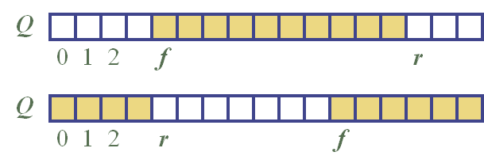
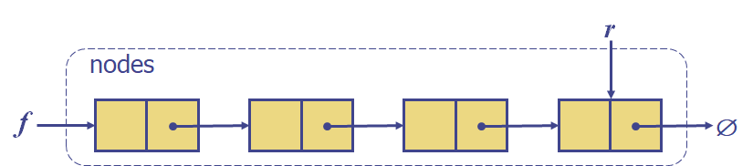

# Queue

first-in first-out

##### 주요 함수

- enqueue(object o) : queue의 가장 뒤에 원소 o를 삽입
- dequeue() : queue의 가장 앞의 원소를 삭제
- front() : queue의 가장 앞의 원소 반환
- size() : queue내 원소의 수 반환
- empty() : queue가 비어있는 지의 여부를 반환

##### 발생 가능한 예외

- 꽉 찬 queue에서 enqueue()를 호출했을 때 예외 발생
- 비어 있는 queue에서 dequeue()를 호출했을 때 예외 발생

##### 사용 예시

- Waiting list
- 공유 리소스로의 접근
- Multiprogramming
- 알고리즘 보조 데이터 구조

##### Array-based Queue

- 크기 n의 환형 배열로 구현
- Queue의 맨 앞과 맨 뒤의 인덱스와 원소 개수를 따로 저장해야한다.

##### Linked-List-based Queue

- Array-based와 다르게 인덱스를 따로 저장할 필요가 없다.

##### Performance

- 사용 공간 : O(n)

- enqueue(), dequeue(), front(), size(), empty() : O(1)