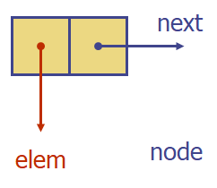
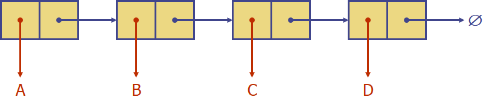

# Singly Linked List

**node 구성**

- elem : node가 가지고 있는 값
- next : 연결된 node로의 link / 주소

Linked List는 node들의 sequence를 포함한 자료구조이다.

Head node : 맨 앞에 존재하는, 다음 node를 가리키는 node

Tail node : 맨 뒤에 존재하는, null 값을 가리키는 node

**Insert**

- Head insert
  1. 새로운 node 할당 및 elem 값 설정
  2. 원래의 head node를 가리키도록 설정
  3. Linked List의 head node를 새로 삽입된 node로 update
- Tail insert
  1. 새로운 node 할당 및 elem 값 설정
  2. 할당된 node가 null 값을 가리키도록 설정
  3. 원래의 tail node가 새로운 node를 가리키도록 설정
  4. Linked List의 tail node를 새로 삽입된 node로 update

**Remove**

- Head remove

  1. Linked List의 head node를 head의 다음 node로 update
  2. 원래 head node였던 것을 삭제

- Tail remove

  1. Linked List 내에서 tail node를 가리키는 node를 탐색
  2. 해당 node를 Linked List의 tail node로 update

  - Singly Linked List에서는 이를 상수 시간으로 처리할 수 없어 비효율적이다.