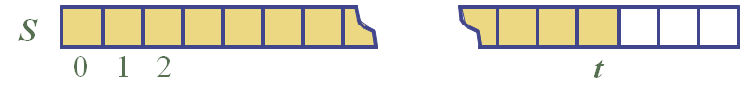

# Stack

임의의 개체를 저장하는 추상 자료형

last-in first-out

##### 주요 함수

- push() : stack의 가장 바깥에 원소를 삽입
- pop() : stack의 가장 바깥의 원소를 삭제
- top() : stack의 가장 바깥 원소 반환
- size() : stack 내 원소의 수 반환
- empty() : stack이 비어있는 지의 여부를 반환

##### 발생 가능한 예외

- 비어 있는 stack에서 pop() 또는 top()을 호출했을 때 예외 발생

##### 사용 예시

- 웹 브라우저 방문 기록
- 텍스트 편집기에서의 실행 취소
- 시스템 메서드 호출 체인
- 알고리즘 보조 데이터 구조

##### Performance

- 사용 공간 : O(n)

- push(), pop(), top(), size(), empty() : O(1)